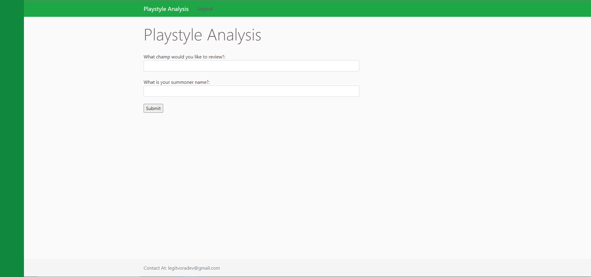
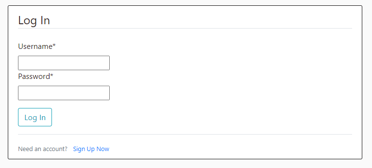
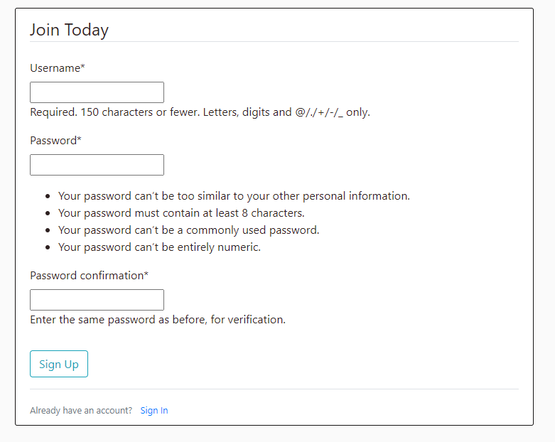
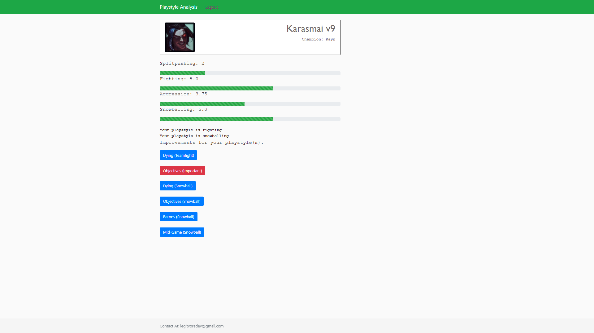
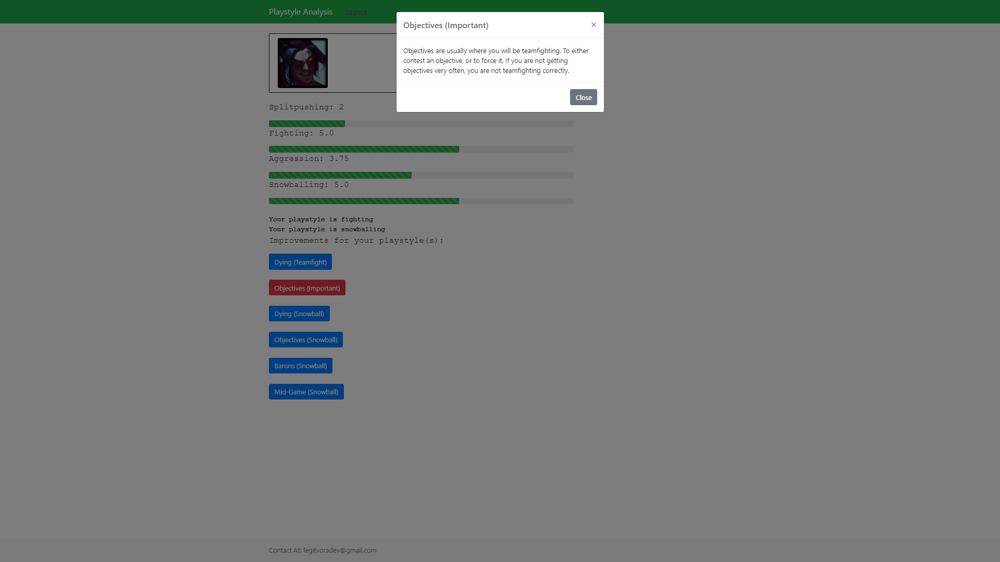
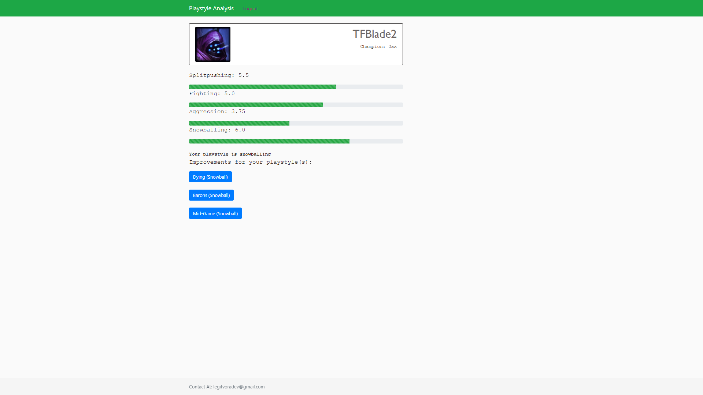
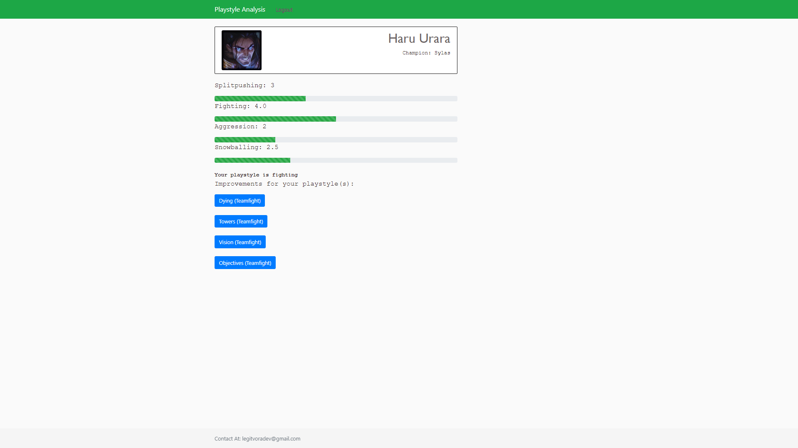
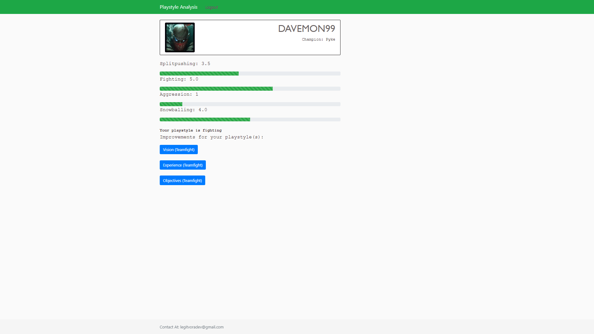

<h1>Playstyle Analysis</h1>
 
This program will take the user's entered summoner name and champion, and determine their playstyle by comparing them to their opponent, in their most recent 7 games.

It can help provide insight on which skills the player can improve on or has recently been unsteady with, as well as what they can improve.

Here are screenshots of the program below:

Home  

Login  

Sign Up  

<h2>The following are examples of statistics for top players on their one-trick champions:</h2>

Example 1:  

Dropdown:  

Example 2:  

Example 3:  

Example 4:  

<strong>Credit to CoreySchafer for Django interface</strong>